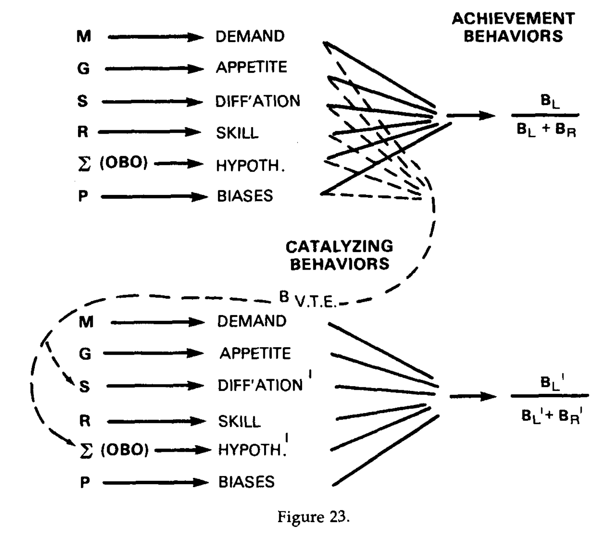
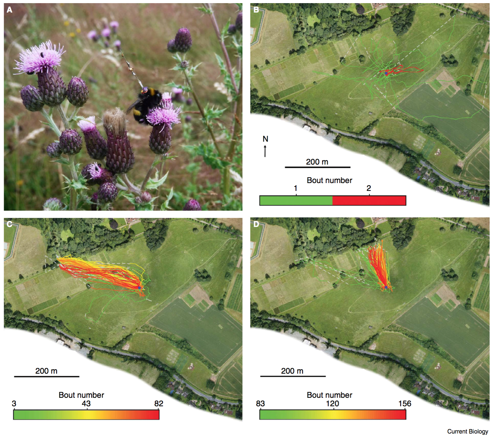

## Our evolving understanding of animal minds: Holism and Mentalism in 19th, 20th and 21st century behavioral biology

**AUTHOR'S NOTE: This is an embryonic working draft, really just a working set of notes for a talk I will give this summer and a paper I will eventually probably write based on that. I will probably circulate another draft before the munch, with cleaned up references as well as hopefully some improved argumentation. In the meantime, feel free to tell me about problems with my arguments and analyses, and tell me about stuff I should read, especially if it challenges my facile interpretations of the various authors, their views or their roles in the arc of history.**
[michael.a.trestman@gmail.com](mailto:michael.a.trestman@gmail.com)

**Abstract**

Important early biologists and psychologists such as Darwin, Spencer, James, Tolman and Von Uexkull assumed that non-human animals have mental processes such as perceptions, memory, emotions, and reasoning; they saw phylogenetic comparison and evolutionary, developmental, ecological and physiological explanations of these processes as core aims of the life sciences. The Behaviorist turn and aggressive application of Morgan's canon cast a taboo over the use of mentalistic concepts for decades, but their careful use has re-emerged in many areas of animal behavior research, as understanding behavior in terms of the cognitive, intentional and affective states of animals has proven to be both fruitful and perfectly compatible with experimental rigor, encouraging a renewal of biology's early ambition toward a thoroughly evolutionary understanding of the mind. However, this will require further theoretical development, likely through engagement across disciplinary boundaries.

**INTRO**

Darwin and Spencer assumed that non-human animals have mental processes such as perceptions, memory, emotions, and reasoning; they saw phylogenetic comparison and evolutionary, developmental, ecological and physiological explanations of these processes as core aims of the life sciences. Mental characteristics and processes were also seen as potentially important for explaining the animals' capacities for acting in biologically adaptive or intelligent ways. Hence, mental processes or characteristics of animals were seen as both targets for investigation in their own right, and as key causal mechanisms that must be included in explanations of animals' capacities if those explanations were to be complete.

Darwin's work *Expressions of the Emotions in Man and Animals* was a comparative effort built on the premise that we can discover reliable causal interrelationships between items in the following three categories:

* environmental conditions and events perceived by an animal
* mental states, processes and events experienced by an animal (memory, judgment, hedonic and motivational feelings, will or conscious intention)
* physiological states, processes, and events that can be observed by others (either by conspecifics in a social setting or by scientists)

One of the themes of the work was that many of the bodily forms of expression of emotions are due to the involuntary effect of sensations and feelings on physiology, and to habitual associations among these and between them and external cues, rather than due to willed control of the body. I.e., he emphasized the relative importance of one set of mental processes (feelings, habitual associations) over another (voluntary control) in explaining the topography of observable behavior. He also emphasized the phylogenetic conservation of forms of expression across various groups of mammals, and assumed that this correlated to continuity of the corresponding mental states as well. For example, “The appearance of dejection in young orangs and chimpanzees, when out of health, is as plain and almost as pathetic as in the case of our children. This state of mind and body is shown by their listless movements, fallen countenances, dull eyes, and changed complexion.” p 83

It was also clear that Darwin thought that cognitive mental behavior such as spatial judgment and planning was biologically significant and could be rigorously investigated. His experiments with worms (1881 ) showed that the way worms manipulated leaves and other objects in constructing their burrows was probably not due to chance with respect to the spatial structure of the object, and inferred that it must involve judgment of that spatial structure by the worm. Darwin ruled out 'instinct' by presenting leaves and artificial objects the worms would not have encountered historically, and also ruled out trial and error learning, although he did think that “to act in this manner and to try different methods makes a near approach to intelligence”. But Darwin was even more impressed by cases where his experiment appeared to show that “the worms judged with a considerable degree of correctness how best to draw the withered leaves of this foreign plant into their burrows”, particularly when this specific judgment required them to “depart from their usual habit” in one way or another.

In Principles of Psychology, Spencer laid out an ambitious program for understanding the mind in a way that was continuous with other natural sciences and could not be cleanly separated from it:

“Biology is a specialized part of Geogeny [Geology], dealing with peculiar aggregates of peculiar chemical compounds formed of the Earth's superficial elements—aggregates which…also exert certain general actions and reactions on one another. And Psychology is a specialized part of Biology, limited in its application to the higher division of these peculiar aggregates, and occupying itself exclusively with those special actions and reactions which they display, from instant to instant, in their converse with the objects, animate and inanimate, amid which they move.” ([Spencer, 1881, Volume 1, p. 138](https://www.ncbi.nlm.nih.gov/pmc/articles/PMC1592350/#jeab-86-01-01-Spencer3))

In the chapter 'The relavity of relations between feelings', Spencer engages in lengthy discussion of the comparative biology of consciousness, as it relates to the form and function of animals bodies. Its interesting to note that this section was added in the second edition, which was heavily influenced by the publication of Darwin's major works in the interim since the first edition.

“The dimensions of our bodies and the spaces moved through by our limbs serve us as standards of comparison with environing dimensions and conceptions of smallness or largeness result according as these environing dimensions are much less or much greater than the organic dimensions Hence the consciousness of a given relation of two positions in space must vary quantitatively with variation of bodily bulk Clearly a mouse which has to run many times its own length to traverse the space which a man traverses at a stride cannot have the same conception of this space as a man Quantitative changes in these compound... Animals having great locomotive powers are not likely to have the same conceptions of given spaces as animals whose locomotive powers are very small. To a creature so constructed that its experiences of the larger spaces around have been gained by long and quick bounds, distances can scarcely present the aspects they do to a creature which traverses them by slow and many steps.” p213

This chapter is historically important for philosophy of mind, because it served as a crucial foil in James' more sophisticated and influential discussion of temporality and time perception. It also powerfully foreshadows the 'embodied' turn, both in its manifestations in the phenomenology of Husserl, Merleau-Ponty, Sheets-Johnstone and others, and in cognitive science. It is also remarkable in its audacious goal of laying out a framework for comparative cognition and phenomenology. The minds of other animals were clearly in the scope of biology, which could give us general principles for understanding how the mind evolves along with other aspects, and which could help us to understand how particular animals experience.

Some of Spencer and Darwin's comparative impressions were wrong, they tend to be much more hierarchical than justified by reality (higher and lower mammals, vertebrates), and to assume that acquatic animals are dumb (he's surprised that porpoises have big brains because they live in 'simple environments').
Also interesting to note that Spencer starts Principles of Psychology by gunning hard for relative brain size as corresponding with 'complexity' and energy output of behavior.

In the first half of the 20th century the life sciences underwent a period of development in which various approaches were confronted with the task of “carving out” (some combination of locating and constructing) tractable empirical domains in which they could document success in the form of reproducible experimental results. This involved adopting various bracketing assumptions, i.e. working assumptions that various classes of causes are irrelevant or out of scope — or causally inefficacious in nature.

Early ethologists such as Heinroth and Whitman focused on applying phylogenetic comparative methods to behavior (similar and in parallel to their application to morphology and physiology), which led to the ethology as the study of evolutionary patterns in behavior, in particular the species specific aspects of behavior earlier called 'instincts' and later 'innate releasing mechanisms' and 'fixed action patterns' (Lorenz 1981).

In this period Jakob Von Uexkull outlined a vision for a science of ecologically driven comparative subjectivity (Strolls). According to this methodology, physiological mechanisms of perception and action could best be understood in a biologically meaningful way, i.e. in relation to their role in ecological interactions, by reference to the animal as a whole, as an integrated perceiving and acting subject that is sensitive to only certain cues or energy sigantures in the environment, which have meaning for it. Von Uexkull termed the environment as it has meaning for a given animal the animal's Umwelt, and conceived of biology as being capable of exploring the diversity, phylogenetic and ecological distribution and dynamics of these Umwelten. Towards this end, Von Uexkull (1934) encouraged us to include the animal itself as a unit of analysis in behavior:
“The mechanists have pieced together the sensory and motor organs of animals, like so many parts of a machine, ignoring their real functions of perceiving and acting, and have even gone on to mechanize man himself. According to the behaviorists, man's own sensations and will are mere appearance, to be considered, if at all, only as disturbing static. But we who still hold that our sense organs serve our perceptions, and our motor organs our actions, see in animals as well not only the mechanical structure, but also the operator, who is built into their organs, as we are into our bodies. We no longer regard animals as mere machines, but as subjects whose essential activity consists of perceiving and acting.”

Doubtless, many investigators of physiological mechanisms of sensation and behavior continued throughout the 20th century to “regard animals as mere machines”, as many do today (Broom 2014). Lorenz (1950, 1981) took the sanguine view that ultimately reductive and holistic approaches were complementary, and healthy science would be characterized by a push-pull relationship between these tendencies, a philosophy of science that foreshadows the multi-level pragmatism of  Wimsatt among others.

“We may summarize the reciprocal methodological errors of vitalists and mechanists by saying that the former dogmatically assume that it is exclusively the whole which is influencing its parts, while mechanists as dogmatically confine their attention to oneway causalities, leading from the part to the whole.” The Comparative Method in Studying Innate Behaviour Patterns 221 by K. Z. LORENZ; in PHYSIOLOGICAL MECHANISMS INANIMAL BEHAVIOUR 1950

In the lab, early Stimulus-Response behaviorists succeeded in producing replicable experimental paradigms for stimulus-response and stimulus-stimulus learning, but these collided with problems raised by the work of Tolman and colleagues on latent learning (Tolman and Hoznick, 1930) and choice (Tolman 1938).

Tolman argued that these phenomena could only be understood by understanding behavior as a unified process with its own distinctive organization, which could not be decomposed without loss into components.

From Tolman 1938:
“(Watson) has defined behavior in terms of the strict underling physical and physiological details, i.e., in terms of receptor-process, conductor-process, and effector-process per se. We shall designate this as the molecular definition of behavior. And, on the other hand, he as come to recognize, albeit perhaps but dimly that behavior, as such is more than and different from the sum of its physiological parts. Behavior, as such, is an 'emergent' phenomenon that has descriptive and defining properties of its own. And we shall designate this latter as the molar definition of behavior...
It will be contentded by us (if not by Watson) that “Behavior-acts”, though no doubt in complete one-to-one correspondence with the underlying molecular facts of physics and physiology, have as 'molar' wholes, certain emergent properties of their own. And it is these, the molar properties of behavior-acts, which are of prime interest to us as psychologists.”

What are these properties?

“To sum up, the complete descriptive identification of any behavior act per se requires descriptive statements relative to:

1. the goal-object or objects, being got to or from,
2. the specific pattern of commerces with means-objects involved in this getting to or from
3. the facts exhibited relative to the selective identification of routes and means-objects as involving short (easy) commerces with means-objects for thus getting to or from.” p 12

“But surely any 'tough minded' reader will by now be up in arms. For it is clear that thus to identify behaviors in terms of goal-objects, and patterns of commerces with means-objects as selected short ways to get to or from the goal-objects, is to imply something perilously like purposes and cognitions. And this surely will be offensive to any hard headed, well brought up psychologist of the present day.
And yet, there seems to be no other way out. Behavior as behavior, that is, as molar, *is* purposive and *is* cognitive. These purposes and cognitions are of its immediate descriptive warp and woof.” p 12-13

Note: In a confusing etymological twist, Tolman used the words 'molar' and 'molecular' to distinguish conceptions of behavior that are holistic or not (see text); These words are used by modern behaviorists, in particular Baum (2002) to make a very different distinction, which will be discussed below.

For Tolman, behavior acts were unified wholes, and behavioral analysis meant understanding them as such.

Further, Tolman believed that behavior in this sense, with its cognitive and purposive dimensions, could be investigated handily with readily accessible experimental models. Consider the following audacious claim:

“I believe that everything important in psychology (except perhaps such matters as the building up of a super-ego, that is everything save such matters as involve society and words) can be investigated in essence through the continued experimental and theoretical analysis of the determiners of rat behavior at a choice-point in a maze. Herein I believe I agree with Professor Hull and also with Professor Thorndike.” Tolman 1938

On the face of it, this is a bizarre claim, and anathema to many animal behavior researchers. How could we understand everything in psychology with the use of such a bare-bones model system? What about biological diversity, the developmental and evolutionary processes, the effects of physical and social environment, the importance of emotional development, etc.? I don't want to defend his claim, but I do think it's worth exploring what you can find out by investigating this kind of choice point, and why Tolman thought it was such a rich experimental model.

Partly because he thought that many different factors were brought to bear on the choice; integrated multiple kinds of information and could be given a factor analysis involving the subject's motivational state and the appropriateness of the goal, sensorimotor capacities, the geometric and signal structure of the environment in relation to those capacities, and any inter- or intra-subjective biases or personality factors that might affect choice. Reinforcement history was consigned to a single term in this system.

He points out that many theorists were working on multifactor models like this. However, Tolman argued that actually that NO model like this could ever be complete, because of something that happens at the choice point.

“I want to suggest that there also appear in maze behavior types of activity other than the simple (right and left turns)* *which we have thus far talked about. If these latter be called "achievement behaviors," then these new types of activity which I now have in mind, may be called "catalyzing behaviors." And it seems that we rat psychologists have to date rather pigheadedly (i.e., like Professor Liddell's pigs) ignored such catalyzing behaviors.
I have two instances which I would here like to call to your attention, although I believe that in the future technological advances in recording will bring to the fore many others for study. The first of these two examples consists of those "lookings or runnings back and forth" which often appear at the choice-point and which all rat-runners have noted, but few have paid further attention to. And the second type is that disrupted sort of activity which appears when a previously obtained **goal **object is removed or blocked.” (Tolman 1938)

He thought that these situations situation induced what he called 'vicarious trial and error' (VTE), which essentially meant that the rats were running extra 'vicarious' or virtual trials. This had the a similar effect to giving the rats additional trails; Essentially, the rats, if given a challenge demanding their attention, and few seconds to look around their environment, could alter their effective trial history by imaging themselves undergoing trials. This introduced unpredictability and in a way took complete control of the rats own reinforcement history away from the experimenters. (Tolman 1938 p. p361-364) Something happened at the choice point that could not be isolated as a component and assigned to an input variable in a function. In computational terms, the rat's choice is a stateful process, the dynamics of which cannot be ommitted from an adequate understanding of the rats behavior.

Several lines of behaviorist theory were developed in response, and workers confronted the underdetermination of the range of available learning theories by the evidence ( Jensen 2006).  And yet, behaviorist experimental paradigms remained empirically powerful in many application contexts. Skinner's influential response was to deny the need for theory, emphasizing the gains that could be made by 'explaining' changes in rates of behavioral performance in terms of the reinforcement schedule to which the rat, pigeon or human were subjected.

“A science of behavior must eventually deal with behavior in its relation to certain manipulable variables. Theories -- whether neural, mental, or conceptual -- talk about intervening steps in these relationships. But instead of prompting us to search for and explore relevant variables, they frequently have quite the opposite effect. When we attribute behavior to a neural or mental event, real or conceptual, we are likely to forget that we still have the task of accounting for the neural or mental event. When we assert that an animal acts in a given way because it expects to receive food, then what began as the task of accounting for learned behavior becomes the task of accounting for expectancy. The problem is at least equally complex and probably more difficult. We are likely to close our eyes to it and to use the theory to give us answers in place of the answers we might find through further study. It might be argued that the principal function of learning theory to date has been, not to suggest appropriate research, but to create a false sense of security, an unwarranted satisfaction with the *status quo*.
...
It is possible that the most rapid progress toward an understanding of learning may be made by research that is not designed to test theories. An adequate impetus is supplied by the inclination to obtain data showing orderly changes characteristic of the learning process. An acceptable scientific program is to collect data of this sort and to relate them to manipulable variables, selected for study through a common sense exploration of the field.” Skinner 1950

'Common sense' could replace burdensome, unproductive theory, and we do not need a theory of the mind at all, as long as we reclassify phenomena formerly regarded as mental, such as recollection, imagination, visual and spatial memory, motivations, love, etc., as not 'mental' at all, but just internal behavior, subject to the same laws of reinforcement as external behavior (Skinner 1974).

And just in case there is anything left over, it is epiphenomenal and we may ignore it:

“a susceptibility to reinforcement is due to its survival value and not to any associated feelings. . . . A person may report that a substance tastes good, but it does not elicit salivation because it tastes good. Similarly, we pull our hand away from a hot object, but not because the object feels painful. The behavior occurs because appropriate mechanisms have been selected in the course of evolution. The feelings are merely collateral products” (Skinner 1974 p 52)

As well as denying that the theoretical problem of explaining latent learning was one that needed to be solved because theoretical problems did not need to be solved Skinner also denied that the experimental paradigm that raised the issue was worth pursuing: “One reason the term "learning" is not equivalent to "operant conditioning" is that traditionally it has been confined to the process of learning how to do something. In trial-and-error learning, for example, the organism learns how to get out of a box or how to find its way through a maze. It is easy to see why the acquisition of behavior should be emphasized. Early devices for the study of learning did not reveal the basic process directly. The effect of operant reinforcement is most conspicuous when there is a gross change in behavior. Such a chance occurs when an organism learns how to make a response which it did not or could not make before. A more sensitive measure, however, enables us to deal with cases in which the acquisition of behavior is of minor importance” Skinner 1953 Science and Human Behavior

So for Skinner, the very empirical phenomenon that caused the theoretical crisis for the rest of behaviorism could simply be ignored, because it was not an ideal experimental system. What was more interesting turned out fortuitously to be what was more empirically tractable: change in response frequency. The problems of latent learning--i.e. how animals learn about their environment, acquisition of novel behaviors wherein "an organism learns how to make a response which it did not or could not make before"--i.e. *how animals figure out how to do things*, and choice--i.e. how animals figure out what to do, could all safely and simply be ignored.

This was part of Skinner's 'molar' philosophy of behavior, which is defended today by behaviorists, especially Baum:
“Momentary behavior” is an oxymoron. By its very nature, behavior is extended in time. If Tom is sitting on the bus, we cannot tell if he is going home, to the store, or somewhere else. A momentary snapshot is subject to maximal uncertainty; only with a larger time sample do we become certain about what Tom is doing.
The temptation to posit private events arises when an activity is viewed on too small a time scale. If we view a snapshot of a moment, we see, for example, Tom with a shovel in the garden, but we have little idea what activity is occurring. Viewing over a slightly longer timeframe, we see that Tom is digging a hole. Viewing on a scale longer than that, we see that Tom is digging a ditch. Longer still, and we see he is laying a pipeline. Longer than that, and we see he is installing a waterfall in his garden. And so on. At each time scale, we see public activity, and no problem arises. But, let Tom stop for a while and lean on his shovel, looking at the ground; then the temptation arises to suppose he is thinking privately about his project. However, we don't know what he is doing at that moment; he might be resting or thinking about getting something to eat. In a larger time frame, we might see that he resumes digging after a while, and even though he took a short break, he is still working on his project. Whatever covert speech may have occurred hardly matters, because Tom is engaged during the period of observation in the activity of digging a ditch, laying a pipeline, or installing a waterfall. Seen on a longer time scale, the activity is continuous, and any private events that occur may be ignored ([Baum, 2002](https://www.ncbi.nlm.nih.gov/pmc/articles/PMC3211378/#bhan-34-02-06-Baum3)).

So on this paradigm the proper target of analysis is not particular behavioral events but temporally extended patterns of behavioral activity, i.e. the rate at which behaviors occur in a block of time. It might be of interest to the student of mechanisms to try and identify the physiological implementation of this or that, but it is not relevant to behavior analysis as such. This went hand in hand with Skinner's philosophy of science emphasizing prediction and control and devaluing theoretical understanding.

This picture is meant to snap together nicely with a reductive selectionist account of evolution, leaving no remainder in the explanation of behavior:
“When ontogenic shaping can be ruled out, it is standard practice to infer that genetic selection has been responsible for an observed difference of this sort.” THE SHAPING OF PHYLOGENIC BEHAVIOR B. F. SKINNER

As a result, any behavior not amenable to explanation in terms of reinforcement conditions can be explained by a hand wave toward genetic selection on behavior. In a complementary move, workers that cannot explain an aspect of behavior in terms of evolutionary optimality can dismiss the remainder as due to 'associative learning'.  'Cognitive' explanation can be deemed unnecessary because, axiomatically, all behavior is best explained in terms of phylogenetic or ontogenetic contingencies.

The dominant paradigm for studying the evolution of behavior in the 2nd half of the 20th century applied an optimality modeling approach rooted in a so-called New-Darwinist interpretation of the modern synthesis, according to which natural selection was the most important (or the only important) cause of evolutionary change, and therefore the most important (or only important) explanatory factor in behavioral biology. The behaving animal would be forgotten again in the excitement of applying universal quantitative postulates (candidate 'laws') such as Hamilton's Rule of kin selection, models of sexual selection such as Fisherian Runaway, 'good genes', Trivers' parental investment theory, Zahavi's Handicap principle of signaling.

In order to cast evolution in terms of these models, what it is crucial is behavior as decomposable into heritable traits (anything else is considered noise), so nothing that occurs during the animal's life matters except whether it has the trait or not and how much it reproduces. On this picture, information is ingested into the genotype through natural selection acting directly on genes, and behavior is expressed by genes through the black box of development, which may be thought of as 'RNA transcription, etc.' Genes signal their quality directly through this behavioral transcription process (known as 'communication'), and are then selected by other genes, which themselves are under selection pressure for the ability to select genes of the highest quality. This approach black-boxes behavior and the role of the organism, leaving no conceivable role for the mind, unless we start a completely different investigatory perspective that begins with questions about the mind—hence, attributions of mental qualities become 'anthropomorphic', simply because they had been deliberately forgotten from evolutionary biology as an expedient measure.

In the 1970s Donald Griffin argued for a return to explicit investigation of mental states such as to animals during the course of research. Specifically, Griffin highlighted several avenues as promising, including studies of animal communication that were interactive in nature (i.e. using forms playback), and studies of search images. These experimental paradigms were in their early stages of embryogenesis at the time. Griffin highlighted that improving technology would make possible forms of experimental intervention that would be less disruptive, more interactive and more revealing. It would be a long arc but many of his hopeful predictions have been born out. Recent developments will be touched upon below.

Another critique of this paradigm has come in the form of the very existence of 'Animal Welfare Science' as a field of study, because it explicitly defines its target domain in terms of mental states (Broom)

Doubt is cast on this paradigm as well from the work West-Eberhard (e.g. 1989,2003), and Jablonka and Lamb (2005), who have illustrated ways in which this theoretical framework is unable to adequately characterize the causal role of the organism in evolution. Their work has emphasized that behavior can be a significant difference-maker in the evolutionary process, rather than behavior being merely an output of evolution. What animals do during their lives can have dramatic long term evolutionary consequences, and what they do can be novel—evolutionarily novel forms of behavior can arise within the lifetime of a single animal. Animals find novel ways to solve problems, to feed themselves and make themselves comfortable, and pursue various other goals such as finding a mate, constructing a home or pursuing long distance migration. The pursuit of these goals in novel situations can yield novel results, reconfiguring the subsequent developmental and selective environment for themselves and potentially many other organisms with whom they interact. These new niches can elicit novel behaviors of other sorts, and indeed can evoke new phenotypes because they may present novel physical geometries affording novel modes of locomation, food types evoking novel foraging strategies, novel predators evoking novel anti-predator responses, etc. Thus, a species can evolve rapidly by 'developmental reorganization' rather than phyletic gradualism, with behavior leading the way.

What is the current state of play? what has been the fate of ideas such as Vicarious Trial and Error and the Umwelt? What of the general concept of understanding behavior in terms of unified acts organized by purposive awareness? What of the experimental paradigm attempting to focus on the choice point?

“The data that have come in over the past decade are clear: Muenzinger, Gentry and Tolman were completely correct — VTE is a process of vicarious (mental) trial and error (search, evaluate and test). Guthrie was also right: when rats pause at choice points, they are indeed 'buried in thought'.” A. David Redish. 2016. *Vicarious Trial and Error*

Rats at choice points continue to reveal things about their minds, even without damaging those minds opto- or otherwise genetically, pharmacologically or surgically.

In recent work Jonathan Crystal at Indiana has shown that rats possess episodic memories that consist of integrated representations of past events that bind together perceptual and action features of the events. (Binding of Episodic Memories in the Rat), and that they 'replay' of episodic memory to recall the order of events they've seen (et al., “Replay of Episodic Memories in the Rat”)

Moreover, learning theorists are challenging the apparent simplicity of even the forms of learning thought to be most basic. Schleyer  et al. (2013) argue that even the apparently simple example of conditioning a drosophila fruit fly larvae to pair a novel olfactory cue with fructose — as simple of a case of classical conditioning as one could find — must be understand in terms that are, in essence goal directed, because of the contextual nuance and flexibility with which it is expressed:

“When larvae are trained with a medium concentra- tion of fructose, they do not automatically show con- ditioned behavior during the test (Figure 5.5A, four plots on the left). If tested in the presence of various fructose concentrations, larvae show conditioned behavior when the sugar concentration at the moment of test is lower than the sugar concentration during training, whereas animals tested on a substrate with a sugar concentration equal to or higher than that during training do not. These differences in condi- tioned behavior are puzzling because the equal train- ing with the medium sugar concentration induces the same memory trace in all these groups. One interpre- tation of this result could be that medium or higher sugar concentrations during the test prevent condi- tioned behavior altogether. This is not the case, how- ever: Conditioned behavior actually is possible in the presence of a medium sugar concentration, provided the training-concentration was higher (Figure 5.5A, right plot). Thus, neither the training concentration per se nor the testing concentration of sugar per se determines conditioned behavior—but their compari- son does.
Our interpretation is that conditioned behavior toward food-associated odors is a search for food, which is abolished in the presence of the sought-for food. This is a fundamental difference in perspective from regarding conditioned behavior as response to the odor. The animals apparently compare the value of the activated memory trace with the value of the testing situation and show appetitive conditioned behavior depending on the result of this comparison. That is, conditioned search is enabled only if the out- come of tracking down the learned odor promises a gain in the sense of yet more-reward than is actually present.”

In a similar vein, Heisenberg (2013) argues, based on learning and memory research, that the brain of drosophila behavior must be understood in terms of its role as an organizer for goal-directed behavior, focusing on 'search' and 'action selection'.

Finally, I want to bring several themes together by discussing a line of research that has a long history (at least back to Darwin himself), which focuses on another 'choice point' — that facing a flower-forager such as a bumble-bee when it selects what flower to visit next. I will argue that this modern research program combines the virtues of the 'holistic' approaches. To my mind it also illustrates that modern behavioral science has regained much of the ambitious scope envisioned by Darwin and Spencer in the 19th century, i.e. that we have developed some potent experimental and theoretical means and rediscovered the will to pursue a genuine comparative and evolutionary biology of the mind.

Darwin (1881)  both framed the question and provided a hypothesis:
“That insects should visit the flowers of the same species for as long as they can is of great significance to the plant, as it favours cross- fertilization of distinct individuals of the same species; but no one will suppose that insects act in this manner for the good of the plant. The cause probably lies in the insects being thus enabled to work quicker; they have just learnt how to stand in the best position, and how far and in what direction to insert their proboscides.”

The puzzle is this: for flower-foraging to achieve pollination and therefor to work for the *flowers*, pollinators must visit flowers of the same species in sequence, otherwise the pollen is wasted. But the foragers are not flying around for the sake of pollinating — they are visiting the flowers to get food, and it seems that a more time and energy efficient way to forage would be, after each flower, to visit the closest flower of any type likely to yield nectar. But many pollinators, and we now know this is true for many insect groups as well as for birds and bats, exhibit a strong “history effect” wherein the likelihood of an animal actually landing and attempting to feed from a given flower, upon encountering it (i.e. approaching it closely enough to identify it) is much higher when the flower is of the same species as the lower flower visited. (Reviewed in robert j. gegear and terence m. laverty 2005; Definition of 'history effect' from Goulson and Wright 1998)

The modern interpretation of what is known as Darwin's Interference Hypothesis (defined in Woodward & Laverty 1992, reviewed in Gegear and Laverty 2005) is that there is a time cost to switching between flowers, because skills improve with learning, pollinators are limited in the variations of flower-handling skills they can remember, and learning new pollination skills interferes with previously learned skills.

An alternative is the 'search image' hypothesis — essentially that an image of the last flower visited is primed in memory, making the animal more likely to spot on matching the image for the next flower. This would make sense if desirable flowers were difficult to spot in their visual backgrounds, which is sometimes true, as animals such as blue jays can improve their performance on spotting cryptic targets by focusing on a single target type (Bond and Riley 1991, reviewed in Gegear and Laverty 2005)

However, the data is complicated and there is both limited support and countervailing evidence for both.hypotheses, and moreover, when considering natural flowers, two options will nearly always differ in many ways related to how they may look or smell to a given foraging animal, as well as in how the animal would have to actually move its body to successfully obtain the nectar or pollen sought. In order to account for this complexity, and inspired by work on human memory in dealing with similar tasks concerned with selecting targets differing in varying sets of factors (e.g. colors, shapes, size, pattern), Gegear and Laverty (2005) propose the Trait Variability Hypothesis: constancy is induced by variation in multiple traits, which makes it hard to remember which combinations are good and bad. Essentially, the complexity of trait combinations imposes a heuristic of 'stick with the same configuration so you don't have to rank a bunch of configurations', a heuristic which humans demonstrably follow too. “Pollinators should exhibit floral constancy and preference when the number of variable traits increases, because information becomes more difficult to process.”

There is pretty good empirical support for this in studies with artificial flowers. Complex trait variability can indeed induce flower constancy more reliably than variation in simple signal or handling trait. But, we might ask, in natural situations, what *actually *induces pollinator constancy? What are the traits that bees or other pollinating animals need to keep straight, and do they actually induce memory load, and if so does that fully explain pollinator constancy?

“Pollinator behavior, through the benefits of constancy, has selected for divergence of floral traits among co-occur- ring outcrossed plants... co-occurring plants are isolated in sensorimotor space. Not only do they vary in several traits, they vary in combinations of traits that are well suited to induce flower selectivity in individual pollinators.”
(Gegear and Laverty 2005)

Because flowers depend on pollinator constancy for survival, the cognitive factors inducing constancy apply selection pressure on the flowers. so we can look at the structure of floral communities, and the distribution of floral traits of sensorimotor relevance for the pollinators, as part of the body of evidence about those cognitive factors.

Menzel (2005), focusing on bees, argues that we can't understand pollinator constancy without thinking about the memory dynamics of the animal doing the pollinating. Moreover, given the information the animals have at their disposal, we should see their constancy behavior as driven by choice, rather than primarily by memory limitations.

“Since most of the approach flights are either return visits to a plant or first visits to nearby ones, pollinators are guided mainly by their memories of the location of productive flowers and the particular features of the flowers (signals, manipulatory properties, reward conditions) that the insects learned during previous visits.”

(This applies to 'hymenepteran pollinators', presumably long-range migratory butterflies, moths, birds, etc., do not all share this situation in general.)

“Here I take up the case for the decision-making process being guided by navigational memories and memories of signals from the flowers themselves. Specifically, I shall argue that the components of the pollinators’ navigational memory are intimately connected with memories of the flower signals, leading to a unique neural representation of localized and qualified objects (nest site, feeding places with particular properties, landmarks passed, etc.). Patches of flowers are localized in space, and bees navigate between loci in a goal-directed fashion. They establish locus-specific memories, and thus their navigational capacities are a major component in returning to a flower, identifying it as a productive one, and handling it efficiently.
Learning all these features of a flower – location, signals, construction – establishes composite memories, whose impact on choice behavior is continuously updated, both with reference to new experience and to elapsing time. Most importantly, memory is not a unique and stable entity of information storage – not in bees nor in any other animal (Milner et al. 1998) – but rather a dynamic process establishes different and sequential forms of memory phases, which are then transformed by con- solidation processes. The central argument put forward here is that the contents and dynamics of the memory phases are the major factors controlling choice behavior, and thus flower constancy.” (Menzel 2005)

Menzel's impressive series of studies with a variety of collaborators, beginning in the late 90s, explores the spatial and temporal structure of information available to the bee at its choice point (reviewed in Menzel 2005). Bees have Specialized Route Memory (SRM), that integrates a sequence of information from many sources including proprieceptive path integration, visual landmarks recognition and distance judgments, compass directions, etc., into: “a memory for the flight route between the hive and a frequently visited feeding site”. Bees also have General Landscape Memory (GLM) which they establish during exploratory learning flights when they enter a novel area for the first time. Bees have been shown to flexibly integrate SRM and GLM to efficiently solve a variety of displacement problems.

Equally important Menzel's work has explored the temporal structure of bee memory, discovering 5 stages through which memory is consolidated, becoming more specific and long lasting. At a given time in a foraging bout, a bee may remember the flower it has just visited, the *patch* of flowers it last visited before it flew across the field to the current patch, as well as the sequence of patches it has visited on the current foray from the hive; information about the location of a flower or patch on the general landscape or along a specialized route, is available, in combination with sensorimotor information, can also be related to long term memory about the location and contents of other patches not recently visited, as well as long term memory about relationships between sensory, motor, and reward properties of flowers in general (i.e. it takes X extraction time/effort to obtain Y average amount of pollen or nectar from flowers with Z visual/olfactory features) that might influence the decision to a flower not usually approached.

Pollinators are also subject to predation pressure from a wide array of predators such as flying insects (bee-wasps, robber flies), birds, and ambush predators (crab spiders, mantises). There is evidence they show location and flower specific avoidance learning, and combining this information (which may not have any immediate sensory cues) with other information for making foraging decisions would impose further, potentially extreme, load. (Reviewed in Dukas 2005, see also Chittka 2017)

Also, to add another dimension, Chittka (2005) emphasizes the role of individual variation. Bees vary greatly in their fully articulated foraging behavior. Some individuals within a colony specializing on a single food source and type (i.e. a flower species and nectar vs pollen) or even a single particularly rich patch, for the majority of their career, while others are opportunistic generalists that continue to add new flowers to their repertoire. Bees also use 'traplines' — sequences of patches and/or flowers within a patch visited during foraging bout. In some , is well documented, so looking at constancy for a short sequence, or of naive bees in an artificial set up, may be very unrealistic compared to their natural foraging behavior. But of course, it is the natural foraging behavior that is under selection.

REPRODUCED TOTALLY WITHOUT PERMISSION FROM Chittka 2017

(A) A worker bee with a harmonic radar transponder attached to its back (photo by L. Chittka). (B) On its first day, the bee makes two excursions, looping in various directions around its hive, in the process memorizing the location of the hive, and landmarks in its vicinity. (C) On day 2, the bee begins by making another orientation loop in the (previously unexplored) Southwesterly direction, and then discovers a flower foraging patch that she visits exclusively until day 6 of her foraging career. (D) Following a few days of bad weather, the bee resumes her activity by first visiting the familiar patch on day 9, but then, on day 10 ‘changes her mind’ halfway along a flight to this patch and flies instead to a different location she had explored only once, 9 days earlier, during an orientation flight. She then visits this location exclusively for the rest of her life until day 13 (panels B–D by Joe Woodgate, Andrew Riche and March Castle).

We have not fully solved the puzzle of pollinator constancy, nor should we expect to fully understand it any time soon. To understand a deceptively simple choice, you need to know the Umwelt of the pollinator—and not just the signals there, but the complexity of extracting invariant relationships among sensory and motor 'signs' (i.e. building up object-intentionality), and the spatial and temporal structure of the animal's awareness of its environment, as well as what goals motivate the animal's choice. This choice is a fundamentally integrated and stateful process *not* decomposable into a set of force variables determining an outcome--as both Von Uexkull and Tolman would have agreed.

Menzel has restricted his focus to bees, but even so, has noticed that memory dynamics may be important in explaining differences in constancy-related behavior between honeybees and bumble-bees. What about moths, butterflies, hoverflies, lesser known groups of pollinating solitary bees, wasps and flies, birds, bats, and other pollinating mammals such as monkeys? Menzel claims that the memory dynamics of the 5 stage consolidation process in bees may be tuned to the spatial structure of bees environments, with, for example, the late-short-term memory consolidation window corresponding roughly to a bees typical visit to a flower patch, allowing for the bee to use specific, localized memory of the patch it has just visited (and perhaps the last patch), with more temporally general information about conditions on the day (medium-term memory), and with context and location-specific conditions about the bee's entire foraging territory and the way it varies over time from long-term-memory. Pollinators may be constant for a variety of reasons, and constancy probably varies among species as well as between individuals of a species due a complex nexus of contextual factors, personality characteristics (e.g. bold/shy, high-/low-sociality), not just 'memory capacity' but perhaps relative capacity along a number of dimensions of variation, and aspects of learning style as well as individual history.

These questions harken back to Spencer's exploration of the phylogenetic possibility space for time and space, encouraging us to consider the possibility space in relation to a Tolmanian analysis of the choice point:

What is the temporal and spatial structural of bees' awareness of the world? How does it shape their expectations from moment to moment? How does awareness manifest in action? What is the structure of their choice? To what extent are these structural properties evolutionarily plastic or invariant, and what are their phylogenetic distributions?

The combined toolkit of Skinner's Behaviorism and the Dawkins-esque optimality approach seems to leave us unable to even grasp the problem, because they leave both the animal and the moment of its choice out of scope.

**Further use of the choice-point as a lense: social recognition**

Finding an appropriate choice point to serve as a productive experimental system can reveal hidden structure in the animal's understanding of the environment. The broad topic of social recognition is an example of an empirically obscure and theoretically murky domain that promises rich rewards in terms of hidden behavioral complexity if only we have the tools to reveal it—how do animals classify other animals: Do they recognize species membership? Do they recognize group-mates? Do they assess kinship? Do they recognize individuals and recall specific information from the history of their interactions?

To answer these questions for a given species you have to know of a choice point where the distinction matters. in other words, you have to know something about the animal's goals and landscape of potential means to achieving them in a context. Choice points involving the following behaviors have been used to document individual specific recognition in the respective animals(Reviewed in Aquiloni and Tricarico 2015):

* dyadic predator inspection in fish (Bshary 2006, Griffiths and Ward 2006, Hsu, Earley and Wolf 2006)

* hermit crab shell trading

* mantis shrimp burrow contests

* crayfish dominance displays

  

**REFERENCES**

Flower constancy in the hoverflies Episyrphus balteatus (Degeer) and Syrphus ribesii (L.) (Syrphidae)
Dave Goulson and Nick P. Wright 1998

Fish Cognition and Behavior 2006, ed. Brown and Laland:

- Bshary 2006 Machiavellian Intelligence in Fishes 
- Griffiths and Ward 2006 Social Recognition of Conspecifics 
- Hsu, Earley and Wolf 2006 Aggressive Behaviour in Fish: Integrating Information about  Contest Costs 

Chittka 2017 Bee cognition. Current Biology Magazine 

Aquiloni and Tricarico 2015 Social Recognition in Invertebrates
Dukas 2005. Effects of predation risk on pollinators and plants
Behaviorism, Private Events, and the Molar View of Behavior [William M Baum](https://www.ncbi.nlm.nih.gov/pubmed/?term=Baum%20WM%5BAuthor%5D&cauthor=true&cauthor_uid=22532740) 2002
Skinner 1950 **ARE THEORIES OF LEARNING NECESSARY? http://psychclassics.yorku.ca/Skinner/Theories/**
EC **Tolman**, CH Honzik 1930 [Introduction and removal of reward, and maze performance in rats.](http://doi.apa.org/psycinfo/1931-02280-001)
The Determiners of Behavior at a Choice Point; Edward Chace Tolman ***Psychological ******Review. ***`1938.45, `**1-41.**
Skinner, B. F. (1974). About behaviorism. New York: Knopf.
Robert Jensen, *Behaviorism, Latent Learning, and Cognitive Maps: Needed Revisions in Introductory Psychology Textbooks*
Mary Jane West-Eberhard. 1989 phenotypic plasticity and the origins of diversity
Mary Jane West-Eberhard. 2003 developmental plasticity and evolutuion
Jensen 2006 Behaviorism, Latent Learning, and Cognitive Maps) https://www.ncbi.nlm.nih.gov/pmc/articles/PMC2223150/#bhan-29-02-02-Skinner2

jablonka and lamb evolution in four dimensions
 https://books.google.com/books?id=27TFIv6p6uoC&pg=PA210&source=gbs_toc_r&cad=4#v=onepage&q&f=false

 Michael Schleyer, Soren Diegelmann, Birgit Michels, Timo Saumweber and Bertram Gerber. 2013. “‘Decision Making’ in Larval Drosophila”